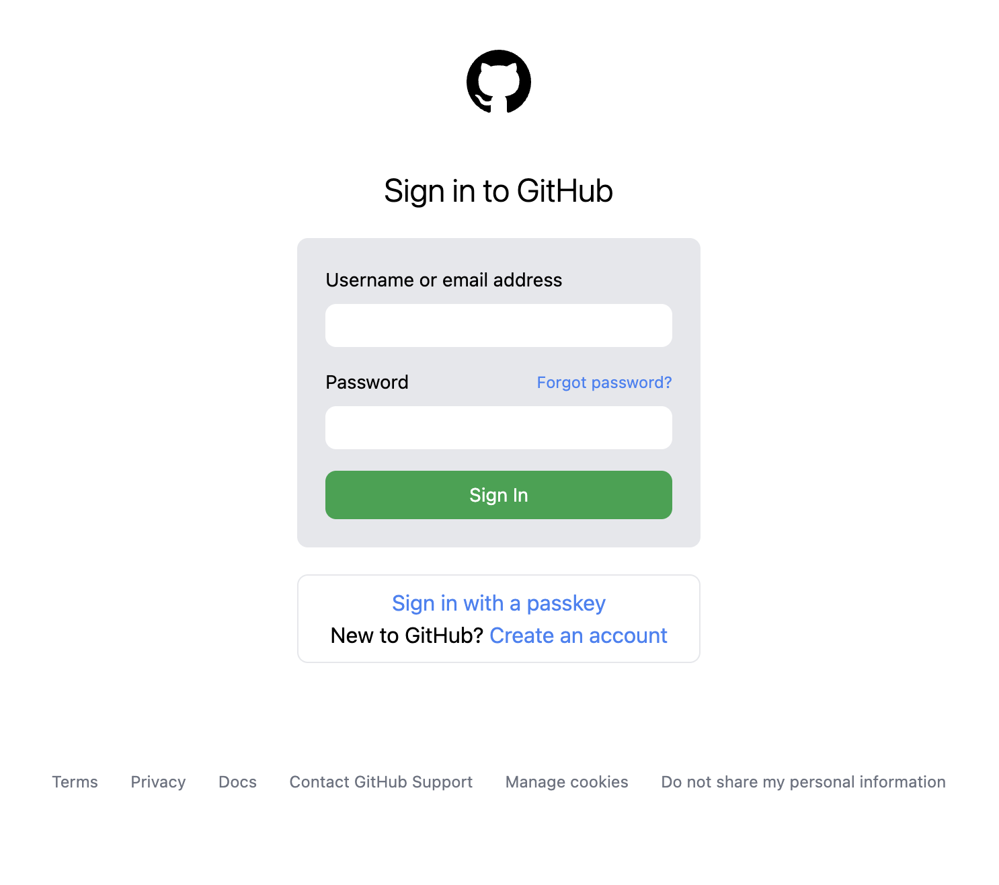

# GitHub Clone  

  

**A front-end clone of GitHub’s layout.**  
A project built to practice responsive design and UI structure by recreating GitHub’s homepage.  

---

## Live Demo  
[Click here to view](https://github-clone-white.vercel.app/)  

---

## Tech Stack  
- HTML / CSS   
- Netlify (Deployment)  

---

## Features  
- Recreation of GitHub’s homepage layout  
- Responsive design for desktop and mobile  
- Practice project focusing on clean UI structure  

---

## Preview  
  
<!-- Replace with your actual screenshot -->
